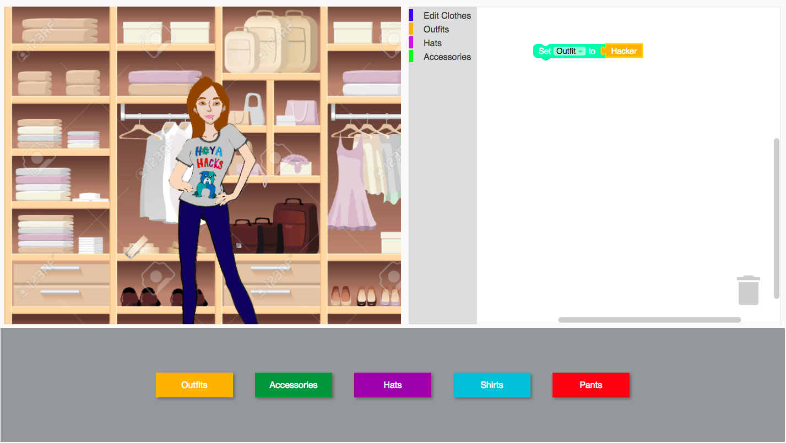

# Anita Makeover!
> [Devpost Link](https://devpost.com/software/anita-makeover) A makeover game that breaks gender-based stereotypes and teaches young girls how to code.




## Requirements

* node.js >= 0.12 [Install Link](https://nodejs.org/en/)


## Getting Started

Use NPM (Package manager bundled with Node.js) to install global dependencies.

```
$ npm install -g gulp           # Gulp runs build scripts

$ npm install -g node-sass      # Node-Sass compiles Sass -> CSS
```

To Run the Project:
```
$ npm install                   # Install all the local dependencies
$ gulp serve                    # Runs the project
```

The project should launch itself in a browser, if not navigate to http://localhost:9000.
## License

MIT